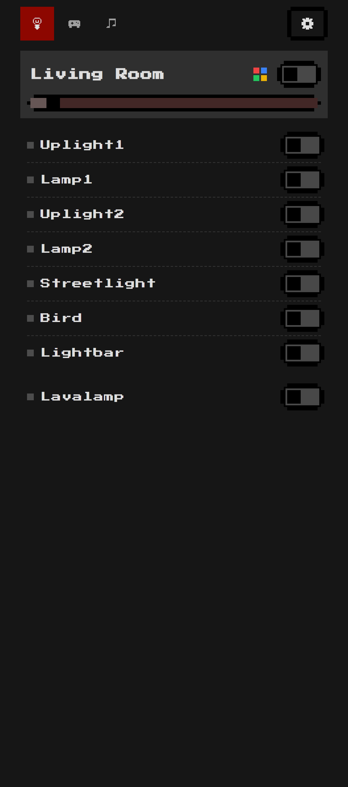
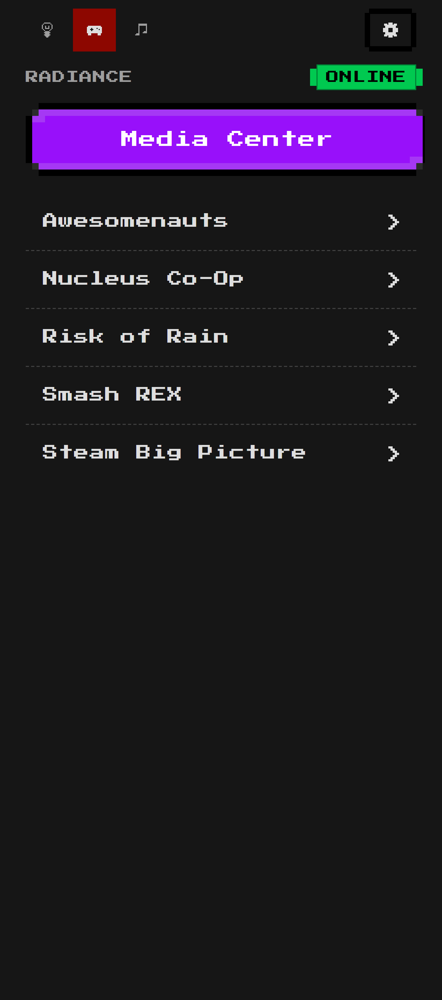
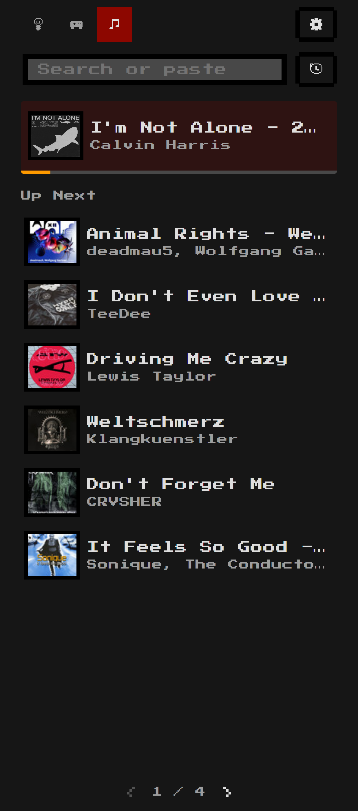
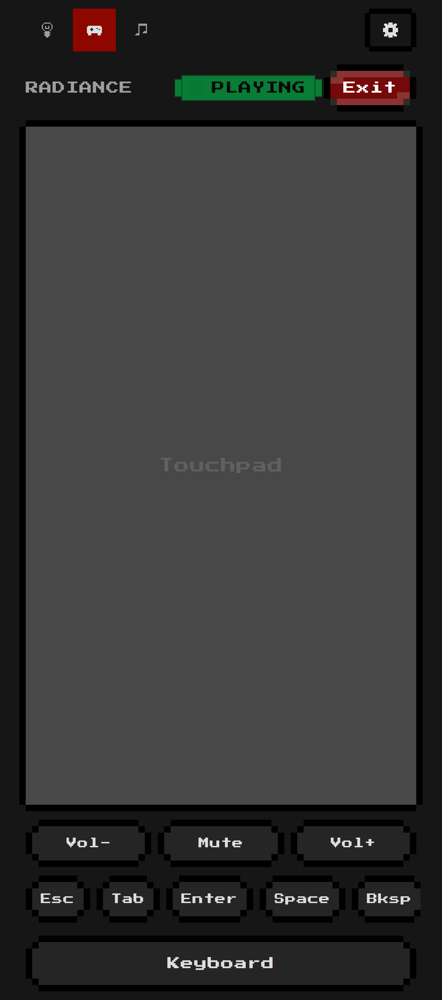
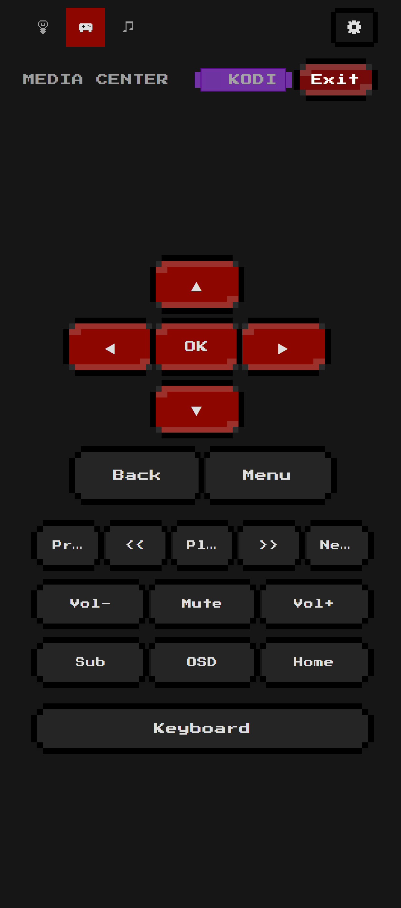
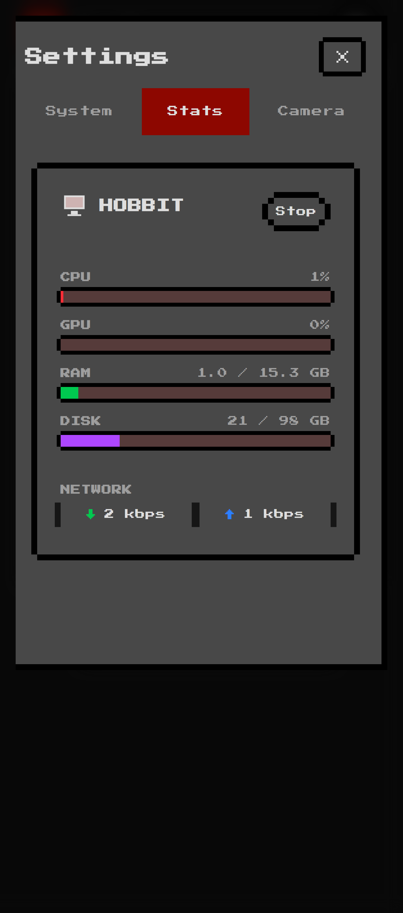
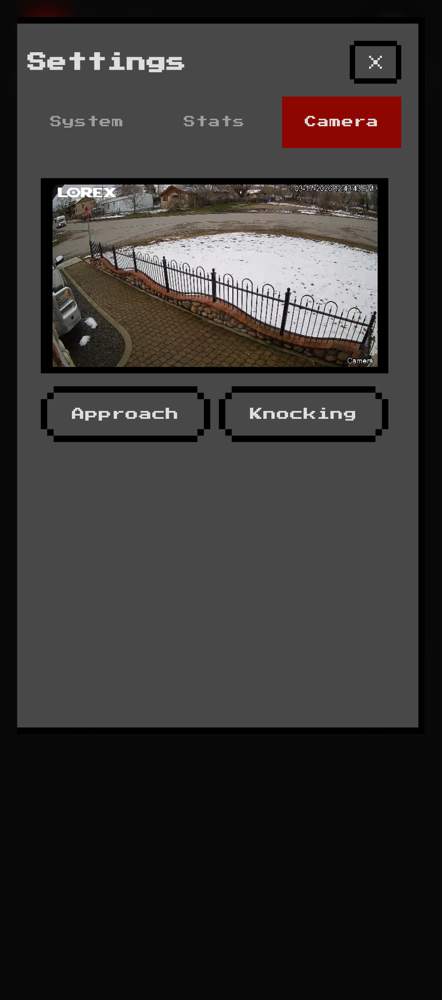

# Hobbit Mini PC Setup

> Transform a Peladn mini PC into a pixel-art smart home hub, game streaming console, and media center — all controlled from your phone.

<p align="center">
  
  
  
</p>

A React SPA with an 8-bit pixel-art UI (8bitcn) served from an always-on mini PC. It talks to a Node.js bridge that orchestrates Zigbee smart lights, Moonlight game streaming, Kodi media center, Spotify queue management, a security camera feed, and system monitoring — all over your LAN with zero cloud dependencies.

---

## Features

### Smart Lights


- Zigbee group control — toggle, brightness slider, color/warmth picker
- Quadratic brightness curve for natural-feeling dimming
- Auto-off timers with live countdown
- Optimistic UI updates with 3s cooldown to prevent poll flickering

<br clear="right" />

### Game Streaming

<p>
  
  
</p>

- Launch PC games via Moonlight (game list synced from Sunshine)
- Virtual touchpad, volume control, and quick keys for remote input
- Automatic HDMI monitor power management on launch/exit
- Real-time Sunshine reachability status badge

### Media Center



- One-tap Kodi launch with automatic monitor power-on
- D-pad navigation + media transport remote control
- PulseAudio → ALSA → 3.5mm analog stereo output
- JSON-RPC proxy for full Kodi control

<br clear="right" />

### Spotify DJ


- Search tracks and add to queue
- Paste Spotify links to queue songs/albums/playlists
- Real-time SSE updates for now playing and queue changes
- Play history with album art

<br clear="right" />

### System Monitoring



- Live CPU, GPU, RAM, disk, and network stats with pixel-art progress bars
- Xbox controller dongle detection and connected controllers
- Lazy monitoring — expensive polling only runs when the page is active

<br clear="right" />

### Security Camera



- WebRTC live feed via go2rtc (RTSP → WebRTC relay)
- PTZ presets with one-tap positioning
- Deep-linkable via `/#camera`

<br clear="right" />

### Guest WiFi

- QR code kiosk page at `/wifi`
- Guests scan to auto-connect — no password typing

---

## Architecture

```
Phone / Browser
  │
  ▼ HTTP (guests) / HTTPS (local CA)
┌─────────────────────────────────────────────────┐
│  Hobbit Mini PC (192.168.0.67)                  │
│                                                 │
│  Nginx (Docker, 80/443)                         │
│  ├── /              → React SPA (static files)  │
│  ├── /api/control/* → Bridge (host, :3001)      │
│  ├── /zigbee/*      → Zigbee2MQTT (Docker, 8080)│
│  └── /sb/*          → SilverBullet (Docker, 3000)│
│                                                 │
│  Also running:                                  │
│  • Mosquitto MQTT (Docker, 127.0.0.1:1883)      │
│  • go2rtc (Docker, :1984 — RTSP→WebRTC relay)   │
│  • dnsmasq (host — LAN DNS server)              │
│  • Tailscale (host — remote access, LE cert)    │
└─────────────────────────────────────────────────┘
  │
  ▼ Moonlight stream
┌─────────────────────────────────────────────────┐
│  Gaming PC (192.168.0.69)                       │
│  Sunshine game streaming server                 │
└─────────────────────────────────────────────────┘
```

The bridge runs on the host (not Docker) because it needs direct access to `/proc`, X11, HDMI control, PulseAudio, and other system-level operations.

---

## Quick Start

### Prerequisites

1. **Windows users**: Ansible runs via WSL — see [docs/ANSIBLE-WSL-GUIDE.md](docs/ANSIBLE-WSL-GUIDE.md)
   ```bash
   wsl --install -d Ubuntu
   # Then in WSL:
   sudo apt update && sudo apt install -y ansible
   ```

2. Flash **Ubuntu Server 24.04 LTS** to your mini PC (hostname: `hobbit`, user: `hobbit`, enable OpenSSH)

3. Copy your SSH key:
   ```bash
   ssh-copy-id hobbit@<ip-address>
   ```

### Deploy

1. Update `inventory.ini` with your mini PC's IP
2. Update `group_vars/all.yml` with your gaming PC's IP
3. Run first-time setup (from WSL):
   ```bash
   cd /mnt/c/Users/YOUR_USER/path/to/minipc-setup
   ansible-playbook playbooks/setup.yml -i inventory.ini \
     -e 'ansible_become_password="YOUR_SUDO_PASSWORD"'
   ```
4. Pair Moonlight with your gaming PC — see [docs/MOONLIGHT-PAIRING.md](docs/MOONLIGHT-PAIRING.md)
5. Deploy everything (from Git Bash on Windows):
   ```bash
   ./deploy.sh
   ```

---

## Targeted Deployment

`deploy.sh` accepts an optional target for fast partial deploys:

| Command | What it does | Time |
|---------|-------------|------|
| `./deploy.sh` | Full deploy — deps, build, everything | ~2-3 min |
| `./deploy.sh web` | Build web UI + copy to remote + reload nginx | ~25-35s |
| `./deploy.sh bridge` | Copy bridge files + npm install + restart service | ~20-30s |
| `./deploy.sh docker` | Sync docker/nginx/mqtt configs + recreate containers | ~15-25s |
| `./deploy.sh kodi` | Deploy Kodi config + restart | ~10s |
| `./deploy.sh nas` | Deploy NAS/Samba config + restart smbd | ~10s |
| `./deploy.sh audio` | Deploy PulseAudio + ALSA config + restart | ~10s |

All builds happen on the server — source is synced via rsync, then `npm install` + `npm run build` run remotely.

---

## Local Development

```bash
cd web
npm install
npm run dev
# Opens http://localhost:5173 — proxies /api to the real mini PC
```

### Capturing Screenshots

The Playwright script captures all app screenshots at Pixel 10 Pro dimensions:

```bash
npm install                    # install playwright (root workspace)
npx playwright install chromium
cd web && npm run dev &        # start dev server
node scripts/screenshots.mjs   # capture all screenshots
node scripts/screenshots.mjs --skip-gaming  # skip gaming/kodi (they launch real sessions)
```

Screenshots are saved to `docs/screenshots/`. See [scripts/screenshots.mjs](scripts/screenshots.mjs) for details.

---

## Hostnames & DNS

The mini PC runs **dnsmasq** as a LAN DNS server. Point your router's DNS to `192.168.0.67`:

| Hostname | Mechanism |
|----------|-----------|
| `hobbit.house` | dnsmasq local DNS |
| `hobbit.local` | mDNS via avahi-daemon |
| `hobbit` | dnsmasq short name |
| `192.168.0.67` | Direct IP (always works) |

See [docs/DNS-SERVER.md](docs/DNS-SERVER.md) for details.

---

## Project Structure

```
minipc-setup/
├── packages/ui/              # @hobbit/ui shared design system (8bitcn + shadcn)
├── web/                      # React 18 + TypeScript + Vite + Tailwind v4 SPA
├── files/
│   ├── bridge.js             # Express backend (single file, runs on host)
│   ├── docker-compose.yml    # Nginx, Mosquitto, Zigbee2MQTT, SilverBullet, go2rtc
│   └── nginx.conf            # Jinja2 template with SPA routing + API proxy
├── roles/                    # Ansible roles (base, security, dns, moonlight, kodi, etc.)
├── playbooks/                # setup.yml (first-time) + deploy.yml (updates)
├── scripts/                  # Setup scripts + screenshot capture
├── docs/                     # Detailed guides
│   └── screenshots/          # App screenshots (generated by Playwright)
├── deploy.sh                 # Targeted deployment from Git Bash
├── inventory.ini             # Target host config
└── group_vars/all.yml        # Shared variables
```

---

## Security

LAN-only by design, hardened for home use:

- **Firewall**: UFW restricts all ports to `192.168.0.0/24`
- **SSH**: Key-only authentication
- **Auto-updates**: `unattended-upgrades` for security patches
- **Nginx**: Security headers + hostname validation + DNS rebinding protection
- **Tailscale**: Remote access with valid Let's Encrypt cert

See [docs/SECURITY.md](docs/SECURITY.md) for full details.

## Backups

Automatic weekly backups (Sunday 2am) via systemd timer to `/home/hobbit/backups/`. Covers all configs, DNS, and SSH hardening. Manual: `ssh hobbit@192.168.0.67 'sudo /usr/local/bin/backup.sh'`

## Documentation

- [Running Ansible from Windows (WSL)](docs/ANSIBLE-WSL-GUIDE.md)
- [DNS Server Setup](docs/DNS-SERVER.md)
- [Moonlight Pairing Guide](docs/MOONLIGHT-PAIRING.md)
- [Security Hardening](docs/SECURITY.md)
- [Troubleshooting](docs/TROUBLESHOOTING.md)
- [Web UI Development](docs/WEB-UI.md)
- [Bridge Service API](docs/bridge.md)
